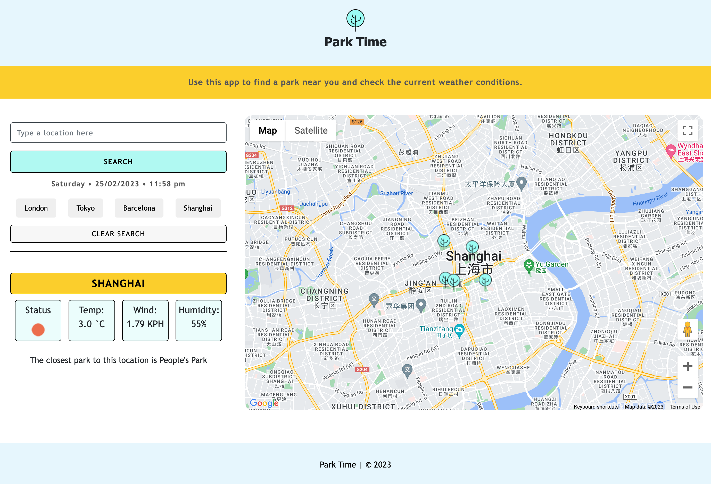

# Park Time

## Description
> If you love spending time outdoors in parks, the Park Time app is an excellent resource to have at your fingertips. Its interface is easy to use allowing you to input your desired location and instantly receive up-to-date weather information via the openweather API. The app provides current temperature, wind speed, and humidity, to help you plan your outdoor activities accordingly.

> In addition, the app integrates the Google Maps API to offer users an immersive experience. By utilizing this tool, the app showcases the selected area and displays all the parks located within a 500m radius of the chosen location. This feature enables users to explore nearby parks and plan their visit with ease.

## Technology
> The browser-based app utilizes GoogleMaps API, OpenWeatherMap API, moment.js and is written in JavaScript to deliver a dynamic and engaging user experience. With these tools, the app is able to update its HTML content in real-time, providing users with the latest information and features.

## Installation
> The app's design is optimized for a seamless user experience on any device. It is designed to be responsive, adapting its layout and functionality to fit the screen size and orientation of desktops, laptops, tablets, and smartphones. This is accomplished through the use of flexible layouts, scalable graphics, and fluid grids that adjust to the user's screen size and orientation. 

## Screenshot

## Licences
> This app is licensed under the MIT license.
